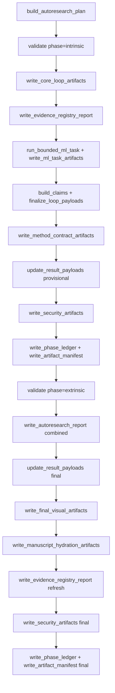

# template_autoresearch_project

Public exemplar for a deterministic bounded AutoResearch workflow over a small
local machine-learning task.

This project demonstrates a file-backed AutoResearch loop that runs inside the
normal template pipeline. The case study uses a local balanced MNIST subset, a
nearest-centroid baseline, and a bounded set of numpy-only neural-network
candidates: softmax regression, a small MLP, and a tiny patch-attention
classifier.

## When to use this template

Use this template when you need a **bounded, offline AutoResearch loop**:
deterministic ML candidate evaluation over a fixed local dataset, with
evidence-linked claims, machine-readable ledgers, artifact-integrity
manifests, and deferred human-review gates. It demonstrates how to make the
research *process* inspectable without claiming autonomous discovery.

Choose [`template_autoscientists`](../template_autoscientists/) instead if
your focus is agent-team **coordination primitives** (dead-end registries,
noise-band confirmation, stagnation-driven reorganization) rather than
AutoResearch loop infrastructure. For the full exemplar roster see
[`projects/AGENTS.md`](../../AGENTS.md#permanent-canonical-exemplars-and-optional-search-add-on).

## Quick start

```bash
./run.sh --pipeline --project templates/template_autoresearch_project --core-only --skip-infra
```

The per-project test/coverage gate (≥90% on `src/`, enforced by
`pyproject.toml` `fail_under = 90`):

```bash
uv run pytest projects/templates/template_autoresearch_project/tests/ \
  --cov=projects/templates/template_autoresearch_project/src --cov-fail-under=90
```

The analysis stage runs two thin scripts:

- `scripts/run_autoresearch_loop.py` builds the ML-loop result, plan, claims,
  stage matrix, review packet, method ledgers, benchmark scores, final figures,
  evidence registry snapshot, schema manifest, local research-object manifest,
  phase ledger, figure-quality report, artifact manifest, readiness report, and
  manuscript-hydration sidecars through `src.loop.run_autoresearch_loop`.
- `scripts/z_generate_manuscript_variables.py` hydrates manuscript variables
  into `output/manuscript/` for rendering and fails when strict run-derived
  manuscript values are not tokenized.

Reusable behavior lives under `src/` in typed packages (`loop`, `ml.data`,
`ml.models`, `ml.training`, `ml.selection`, `ml.task`, `diagnostics.records`,
`diagnostics.metrics`, `diagnostics.intervals`, `diagnostics.reports`,
`models`, `config`, `writers`, `reports`, `figures`, `manuscript_variables`).
No network calls, LLM calls, runtime dataset downloads, generated-code
execution, or autonomous approval loops are used.

The manuscript frames the exemplar as a bounded research-object analogue:
machine-readable ledgers, artifact manifests, figure registry metadata,
variable provenance, phase-settlement records, figure-quality checks, and
deferred review gates make the research process itself inspectable without
claiming autonomous discovery.
Each registered figure carries a source artifact, generation method, validation
hook, alt text, caption, and claim boundary; manuscript figure blocks and the
figure-method table are hydrated from that registry.
The local security layer adds a deterministic threat model, SBOM-style
inventory, checksum attestation, and adversarial review packet. These artifacts
support local research-artifact integrity claims only; the default run performs
no external signing and does not claim production SLSA compliance.
The reviewer-facing evidence registry report is compact by default: validation
still builds the full in-memory fact registry, while
`output/reports/evidence_registry.json` records counts, source tiers,
freshness warnings, and a bounded fact sample. Set
`TEMPLATE_EVIDENCE_REGISTRY_FULL=1` only for local debugging when a full
`output/reports/evidence_registry_full.json` dump is needed.

Loop stages are recorded as **declared** (configured intent). Claims are
**supported** only when their evidence file exists locally **and carries
substantive (non-empty, parseable) content** — an empty or hollow placeholder
does not support a claim. The same substance check guards the figure-quality and
benchmark gates, so a structurally-complete-but-hollow run is scored as
incomplete rather than silently certified.

**Validation boundary.** The claim, figure-quality, and benchmark gates bind to
substantive content and are exercised by fault-injecting negative-control tests
(`tests/test_gate_negative_controls.py`, `tests/test_gate_improvements.py`) that
prove each one fails closed. The former self-referential gates are now hardened
into production gates:

- The **schema manifest** validates field/type *conformance* for the governance
  schemas; a nonconforming payload is a **hard gate** — `write_schema_manifest`
  raises and aborts the loop rather than writing a green manifest.
- The **security/integrity attestation** fails a present-but-empty required file
  and cross-checks the input MNIST fixture against its *committed declared* hash
  (external truth, failing closed if that declared hash is absent).

One check is deliberately **opt-in, not default-enforced**, for a principled
reason: the **evidence registry** can require strict-zone manuscript numbers to
trace to trusted source tiers (external/input/declared, not the run's own
`generated_metric` output) via `validate_text_against_registry(...,
trusted_number_tiers=...)`. But an AutoResearch manuscript legitimately *reports
its own run's metrics* — the hydrated manuscript contains ~285 such strict-zone
numbers — so forcing this check on would reject the paper's own findings. The
**default** evidence gate already fails any manuscript number that matches *no*
generated artifact (fabrication); the strict-tier check is provided for
manuscripts that cite external numbers, and the registry's `source_tiers` field
discloses the provenance mix. The **research-object manifest** remains a
path/size/checksum inventory by design.

Accepted seed ideas require evidence links, candidate edits are bounded by
`edit_allowlist`, and configured review gates are recorded as human-review
inputs rather than self-approval. The generated review decisions are `deferred`
so a human reviewer still owns publication approval. A true publication
approval can only be read from the human-authored `human_review.yaml` file.

## Loop orchestration



Project-specific docs live in [`docs/`](docs/).
The project-level next-work roadmap lives in [`TODO.md`](TODO.md).

## Outputs

- `output/data/autoresearch_plan.json`
- `output/data/autoresearch_loop.json`
- `output/data/autoresearch_claims.json`
- `output/data/autoresearch_stage_matrix.csv`
- `output/data/autoresearch_review_packet.json`
- `output/data/research_program.json`
- `output/data/idea_ledger.json`
- `output/data/run_ledger.json`
- `output/data/review_decisions.json`
- `output/data/benchmark_scores.json`
- `output/data/mnist_task_config.json`
- `output/data/ml_task_results.json`
- `output/data/ml_candidate_ledger.json`
- `output/data/ml_confusion_matrix.csv`
- `output/data/ml_training_history.csv`
- `output/data/ml_error_examples.json`
- `output/data/ml_prediction_records.json`
- `output/data/ml_classification_diagnostics.json`
- `output/data/ml_candidate_intervals.json`
- `output/data/ml_class_balance.json`
- `output/data/ml_calibration_report.json`
- `output/data/ml_calibration_bin_intervals.json`
- `output/data/ml_robustness_report.json`
- `output/data/ml_probability_diagnostics.json`
- `output/data/ml_bootstrap_intervals.json`
- `output/data/ml_paired_comparison.json`
- `output/data/ml_statistical_summary.json`
- `output/data/ml_training_diagnostics.json`
- `output/data/ml_candidate_rank_stability.json`
- `output/data/ml_candidate_selection_audit.json`
- `output/data/ml_diagnostic_boundary.json`
- `output/data/autoresearch_phase_ledger.json`
- `output/data/figure_quality_report.json`
- `output/data/autoresearch_security_profile.json`
- `output/data/autoresearch_threat_model.json`
- `output/data/autoresearch_supply_chain_inventory.json`
- `output/data/autoresearch_inventory_export.json`
- `output/data/autoresearch_integrity_attestation.json`
- `output/data/autoresearch_schema_manifest.json`
- `output/data/research_object_manifest.json`
- `output/data/manuscript_variables.json`
- `output/data/manuscript_variable_provenance.json`
- `output/data/manuscript_figure_blocks.json`
- `output/figures/autoresearch_stage_matrix.png`
- `output/figures/ml_candidate_scores.png`
- `output/figures/ml_confusion_matrix.png`
- `output/figures/ml_per_class_accuracy.png`
- `output/figures/ml_learning_curves.png`
- `output/figures/ml_complexity_accuracy.png`
- `output/figures/mnist_error_examples.png`
- `output/figures/ml_calibration_reliability.png`
- `output/figures/ml_classification_metrics_heatmap.png`
- `output/figures/ml_confusion_pairs.png`
- `output/figures/ml_generalization_gap.png`
- `output/figures/ml_robustness_matrix.png`
- `output/figures/ml_probability_margin_distribution.png`
- `output/figures/ml_bootstrap_intervals.png`
- `output/figures/ml_paired_correctness.png`
- `output/figures/ml_selective_accuracy.png`
- `output/figures/ml_probability_quality.png`
- `output/figures/ml_training_dynamics.png`
- `output/figures/ml_candidate_rank_stability.png`
- `output/figures/autoresearch_candidate_lifecycle.png`
- `output/figures/mnist_class_balance.png`
- `output/figures/mnist_subset_contact_sheet.png`
- `output/figures/autoresearch_closure_flow.png`
- `output/figures/autoresearch_security_control_matrix.png`
- `output/figures/autoresearch_integrity_chain.png`
- `output/figures/figure_registry.json`
- `output/reports/autoresearch_loop.json`
- `output/reports/autoresearch_loop.md`
- `output/reports/autoresearch_review_packet.md`
- `output/reports/autoresearch_summary.md`
- `output/reports/autoresearch_security_review.md`
- `output/reports/ml_experiment_report.md`
- `output/reports/ml_benchmark_score.json`
- `output/reports/autoresearch_readiness.json`
- `output/reports/autoresearch_readiness.md`
- `output/reports/benchmark_readiness_smoke.json`
- `output/reports/evidence_registry.json`
- `output/reports/artifact_manifest.json`

`output/reports/evidence_registry.json` is intentionally a compact summary, not
the full validation registry. Full fact serialization is opt-in with
`TEMPLATE_EVIDENCE_REGISTRY_FULL=1` and is not a required artifact.

## Tests

```bash
uv run python scripts/01_run_tests.py --project templates/template_autoresearch_project --project-only --quiet
```
